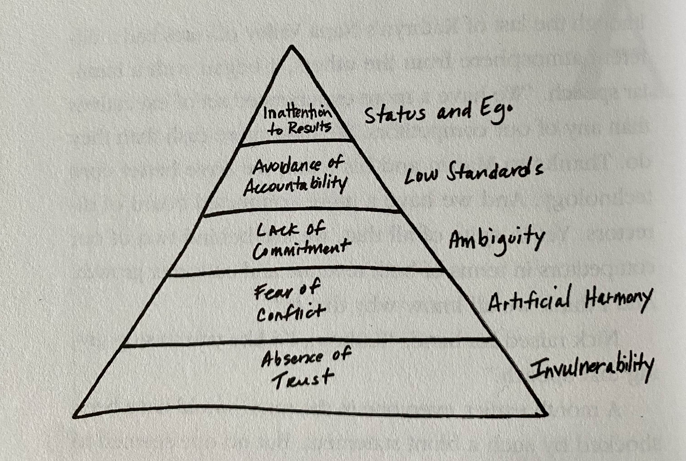

In my [2023 goals post](https://www.galelmalah.com/posts/2023-goals/#project--team-management), I mentioned that one of my objectives is to improve my skills as a team manager by reading two books on the subject. One of the books I had in mind was _"The Five Dysfunctions of a Team"_.  
I already heard a lot of great things about this book from a couple of colleagues and the reviews on [goodreads](https://www.goodreads.com/book/show/21343.The_Five_Dysfunctions_of_a_Team) are mostly positive, so I was excited to find that Orly Tokov, our group ops manager, had left the book on my desk.

I couldn't wait to dive into _"The Five Dysfunctions of a Team"_, so I read it in one sitting the day after. Here are my thoughts and notes on the book.

## Quick Summary

_don't want to read the whole thing? this section will give you a brief description of the book._

The author takes us through 5 important building blocks - dysfunctions, to create effective teams that create valuable results.  
Those dysfunctions are explained in an exciting story-like way that keeps you engaged throughout the book and simply drives the core principles.

### The Story

The book begins with the company "DecisionTech", once considered the next big thing. They had it all, funding, a top-notch executive team, and a great product **but** two years later they find themselves lacking behind the competition and struggling to stay in the game.

The board chairman decides to get a new CEO, **Kathryn** (our hero). Kathryn has no experience in the tech world and she's not the usual "high-tech" persona.
For the first few weeks of her job, Kathryn just observe her upper management team and takes notes on how they work as a team.

> The author also made sure to introduce each team member in a manner that gives us, the readers, all the context we need.

After Kathryn decides she's seen enough, she starts acting on her assessments. That is that the upper management team is a **Dysfunctional** team.  
She then slowly exposes the team to the **Five Dysfunctions** and takes them on a journey that passes through each dysfunction.  
Like every great journey, it is filled with peril, fear, struggles, and wins.
People quit, break down and new people join.

In the end, The team becomes more trusting of one another, they are not afraid to get into arguments and most importantly they put the company goals above their own (ego-driven goals).

---

Here are the 5 Dysfunctions as presented in the book

> It's not by accident that they are presented as a pyramid, according to the author, each dysfunction facilitates the one above it.

For example, let's take the first one **Absence of Trust**:

Team members are afraid to be vulnerable with one another, meaning, they conceal their weaknesses, withhold their opinion, fail to admit when they are wrong and are afraid to ask for help.

This leads to **Fear of Conflict** because **people don't like to feel stupid**, and when team members are not comfortable being vulnerable with one another, they may avoid speaking their minds out of fear of being judged or appearing incompetent.
This results in a shallow discussion of important topics, people just nod in agreement or resorts to some toxic behavior like making their opinions known after the fact, behind the back of the team.

### Main Takeaways

- As a team lead, you should lead by example and set the standard for vulnerability within your team. This means admitting your mistakes, asking for help, and being open to feedback.
- Trust is an important aspect of team building that need to be actively worked on.
- Encourage transparency and open communication within your team by consistently sharing progress, challenges, and successes. This helps to build trust and create a sense of shared ownership among team members.
  Here are a couple of examples
  - Got an important issue resolved? Share it with the team.
  - Have a question? Ask the entire team.
  - Send PRs in the team slack.
- Encourage discussion within the team by proactively asking for feedback in team discussions, given enough time and trust those discussions will occur naturally without you (the team lead) driving them.
- DECIDE! Don't let arguments end in ambiguity. Either decide on the action yourself or encourage the team to resolve them in a decisive way.
- Make sure expectations and deliverables are clearly defined and get team members to commit to those efforts and raise any concerns they might have.
- Share the end goal with the team, make sure they are aware and understand the importance of that goal, and praise/reward individuals that act towards the good of the overall outcome.

### Favorite Quotes

Before delving into the five dysfunctions of a team, I wanted to share some quotes that I found particularly meaningful from the book.

**_"If you could get all the people in an organization rowing in the same direction, you could dominate any industry, in any market, against any competition, at any time."_**

**_"A fractured team is just like a broken arm or leg; fixing it is always painful, and sometimes you have to re-break it to make it heal correctly. And the re-break hurts a lot more than the initial break, because you have to do it on purpose."_**

**_"If we don't trust one another, then we aren't going to engage in open, constructive, ideological conflict, And we'll just continue to preserve a sense of artificial harmony."_**

## The Five Dysfunctions {.text-divider}

In this section we will deep dive into each dysfunction, combining the author's explanation and my point of view.

For each dysfunction I will provide 3 key points:

1. Connection to the previous dysfunction.
2. Signs that your team might be suffering from that dysfunction.
3. How to overcome that dysfunction.

## Absence of Trust

Team members exhibit invulnerability, they are afraid to show their weaknesses, share their opinions with the team, and admit when they are wrong.

When we have trust, we can be honest about expectations from one another and ask for help/ask questions without the fear of feeling stupid.

### Signs of Absence of Trust

Team members

- Hide their weakness.
- Afraid to ask questions/help.
- Afraid to give help.
- Hold grudges over unresolved issues.
- Fail to take advantage of their team member's strength.
- Cover up mistakes or failing to admit them.

### Ways to Build Trust

- Team activities.
- Encourage discussions about their personal life.
  This can be done by having each member answer a list of questions or more naturally by sharing something yourself and asking others to share as well.
- Lead by example. Admit when you are wrong, ask for help and make your work visible.

> The author suggests an exercise where each team member takes a personality test and then discuss it with the team, in my opinion, they are too random and often time are just wrong but it's something to consider.

## Fear of Conflict

Team members avoid discussing important topics or have shallow, passionless discussions that do not lead to resolution.

We are part of a generation that is thought to steer clear of any conflict and conform to the norms, this makes "conflicts" a hard thing to do and even harder to do right.

> The author describes lack of conflict as **"Artificial Harmony"**, I couldn't agree more with that statement.

### Connection to Trust

When you have trust you are more willing to engage in open and honest discussion because you know that if you say the wrong thing or god forbid don't understand something, you won't be thrown under the bus.  
When you trust your team enough to be vulnerable in front of them it makes sharing ideas and concerns less "scary".

For example, imagine a team where everyone is afraid to speak up because they fear being criticized. This team is unlikely to make the best decisions because they lack honest discussion revolving around these decisions.

> Trust is not only important for teams but for almost any relationship you have in your life.

### Signs of Fear of Conflict

- Personal grudges.
- Silently nodding in agreement.
- Toxic behavior like rolling eyes or throwing some smirky remarks.
- "I told you so" mentality.
- Boring meetings.
- Back-channel politics and personal attacks.

### What Makes a Good Conflict

- No politics.
- Revolves around critical areas (not a must).
- Passionate discussion.
- All team members are heard.
- Ends with a resolution.

### Ways to Drive Conflict

- Point out the importance of conflicts.
- Make sure to eliminate toxic remarks the minute they happen, at times, visibly in front of the team.
- Encourage asking questions and discussions by doing so yourself.
- Build trust 😏.

> We are talking about constructive conflict and not personal, spiteful conflict.

## Lack of Commitment

This one is important from the perspective of the team lead because often time you will need to choose between two opinions, decide on a clear course of action, and make sure everyone understands why you decided to go with X instead of Y.

The book describes this as a function of two things: **clarity** and **buy-in**.  
Clarity, meaning, the path ahead is clearly defined with deliverables and expectations.  
Buy-in, meaning, the entire team is on board with the effort even if some of the team members disagree with the course of action.

Having buy-in is a direct product of a healthy **conflict** culture, without letting people be heard we are more likely to end up with people half-assing the work assigned to them.

### Connection to Conflict

Conflict is a key ingredient in getting people to commit. Why?
Debating over some topic creates **clarity** and since your opinions and concerns were taken into account you are more likely to **buy-in** toward the effort because you were acknowledged.

Imagine you are in a meeting about a new project and you disagree with some of the goals, technical direction, or whatever, if you fail to raise your concerns or thoughts and just nodded in agreement you will come out of this meeting with some resentment towards the overall goal (you won't buy-in) and you will not be sure about your role in this whole thing (lack of clarity).

### Signs of Lack of Commitment

- Seeking consensus. We can't always all agree with one another and the path ahead needs to be clear to move forward.
- Fear of failure.
- When things go a bit wrong the blaming game starts.

### Ways to Increase Commitment

To promote commitment on the team, it is important to:

- Communicate the team's goals and objectives, and how each team member's role contributes to the success of the team in a clear way.
- Set clear deadlines.
- Encourage team members to openly share their opinions and ideas, and make sure that all voices are heard and considered during decision-making.
- Foster a sense of ownership and pride in the team's work, by involving team members in the planning and execution of projects and tasks.
- Acknowledge their work and the impact it made on the team.

## Avoidance of Accountability

In a team where accountability is avoided, team members are afraid or uncomfortable with confronting each other about their progress or the quality of their work. This leads to an overall decrease in productivity and quality.

Let's face it, holding people accountable is uncomfortable or even scary! We don't want to make people feel bad about their work but...
In reality, **not** holding people accountable is a selfish act, **we** don't want to feel bad for making them feel bad.  
If you care about your team you should hold them accountable! You owe it to them.
Otherwise, how will they know to improve? Or that their actions are aligned with your expectations?

Holding people accountable means that you **respect** them and their craft and your expectations from them reflects that respect.

> As an Israeli, I am used to conflict, we thrive on it. However, even I find it uncomfortable to hold others accountable. It's just one of those awkward situations that no one really enjoys.

### Connection to Commitment

Accountability and commitment are tightly coupled. Without clarity about what's expected from each team member and the overall direction, it will be difficult to hold them accountable. Additionally, by encouraging team members to buy-in to the project/effort and ensuring they understand the reasoning behind it, it's easier to hold them accountable for their progress and overall outcome.

### Signs of Avoidance of Accountability

Team members

- Fail to follow through with their tasks.
- Suffer from lack of progress or poor performance toward the overall goal.
- Fail to comment on things that bother them like the quality of code, not meeting deadlines, or unclear product specs.
- Endure toxic behaviors and habits that hurt the team.

### Ways to Increase Accountability

- Set clear standards and expectations by establishing "team values" that outline the processes and behaviors expected of the team as a whole. This ensures that everyone knows what is expected of them and helps to eliminate confusion or uncertainty. These values should be written and discussed with the rest of the team to ensure **commitment** toward those values.
- Regular progress checkups.

## Inattention to Results

When you lack attention toward results in your team, team members are more likely to put their goals and ambitions higher than the team/organization goals.  
This isn't only about individuals, it might affect whole departments or teams that value their status or prestige at the expense of the organization success.

As a team leader, you should strive to have your team understand what they are working toward and give clear metrics of success that define the desired result.

The author provides several examples throughout the book, but one that particularly resonated with me was a scenario in which a basketball team is in the final seconds of an important game.  
The coach determines that the best way to win is to pass the ball to the team's best three-point shooter. However, the team's star player disagrees and wants the ball for himself, prioritizing his own ego over the wider goal of winning the game.  
In the end, the coach benches him, the team wins, and the star player publicly apologizes for his behavior. This example effectively drives home the importance of maintaining focus on results.

> This is not to say that individual goals and ambitions are not important it's just that when it comes to work they should **always** be second to the overall goal of the team or organization.

### Connection to Accountability

If you don't hold people accountable how will you steer them toward the best result for the wider goal?  
Failing to do so will result in team members shifting their attention toward other things and sending the signal to others that it's ok.

### Signs of Inattention to Results

Team members

- Are distracted from the wider goal.
- Fail to reach the desired result on some parameter like time, budget or quality.
- Define their metric of success that is detached from the desired result.
- Other members of the team that are actually working toward those results are discouraged or even leaving the team.

### Ways to Focus Results

- Make sure objectives are clear.
- Value team members that focus their attention on results.
- Publicly declare what considers a successful outcome.

## The End {.text-divider}

In conclusion, "The Five Dysfunctions of a Team" is written in an engaging way that keeps you hooked and effectively delivers the author's message.

The author did a great job emphasizing the importance of vulnerability-based trust, effective conflict, achieving commitment, holding team members accountable, and focusing on results.  
I think it also acts as a reminder that team management is not only removing obstacles and getting work done and if you want to truly create an effective team for the long run you need to foster a culture where people feel safe to be vulnerable, communicate clearly and are committed to the wider goal.

Throughout the book the author help guide leaders in their role in each of these dysfunctions and how you can work towards mitigating them.

Overall, I think this book is a must-read for aspiring managers that want to understand how to build great teams that work effectively. It helps understand and identify issues that you might didn't known existed in your team and provides a lot of "aha" moments when you realize this also apply to your team.
